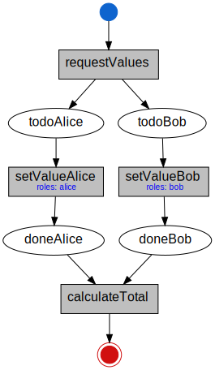

<p align="center">
<a href="https://www.adjoint.io">
  
</a>
</p>

FCL
===

FCL is the Adjoint financial modeling language. Adjoint provides domain modeling
tool for building safe, secure, and transparent workflows for financial products
and digital process automation.

FCL is a state machine description language designed around three core ideas:

* **Predictability**
* **Analysability**
* **Accuracy**

An FCL workflow is structured as a free-choice workflow net. Many interesting
properties, such as deadlock-freedom, for these systems are decidable. This
makes FCL workflows amenable to static analysis and easy to understand because
they correspond closely to well-known concepts like flowcharts and business
process model notation. Transitions in FCL can also be guarded by dynamic role
and temporal preconditions allowing us to model-check the entire workflows's
lifecycle.

Adjoint offers solutions to allow enterprises to build auditable and
synchronized business processes that scale across large vendor and consortium
networks, enabling the next generation of international commerce.

* [Adjoint Inc.](https://www.adjoint.io)
* [Workflow Engine](http://dev.adjoint.io/fcl_lang.html)
* [Workflow Model](http://dev.adjoint.io/fcl.html)
* [Uplink API](http://dev.adjoint.io/api.html)
* [Uplink Usage](http://dev.adjoint.io/uplink_usage.html)
* [Uplink Protocol](http://dev.adjoint.io/uplink_proto.html)
* [Uplink Configuration](http://dev.adjoint.io/uplink_config.html)

Quickstart
----------

To install FCL from source install the standard
[stack](https://docs.haskellstack.org/en/stable/README/) tooling.

```
$ git clone git@github.com:adjoint-io/fcl.git
$ cd fcl
$ stack install
```

Use the FCL executable to compile, format, lint, extract the graph of a script.

```bash
$ fcl --help
Usage: fcl (COMMAND | COMMAND | COMMAND | COMMAND | COMMAND | COMMAND | COMMAND
           | COMMAND)

Available options:
  -h,--help                Show this help text

Available commands:
  compile                  Compile and typecheck a script.
  format                   Format a script
  lint                     Lint a script.
  graph                    Extract graph from a script.
  transitions              Infer the transition declarations of a script.
  reachability             Calculate the reachabality graph
  undefinedness            Run the undefinedness analysis
  fast-undefinedness       Run the fast undefinedness analysis
```

### Examples:

We provide several examples programs which model financial workflows, data
reconciliation, pre and post trade attestation, and structured product lifecycle
management:

* [Hello World 1](examples/minimal.s)
* [Hello World 2](examples/simple.s)
* [Swap](examples/swap.s)
* [Zero Coupon Bond](examples/zcb.s)
* [Novations](examples/novation.s)
* [Gas Forward](examples/gas-forward.s)
* [Structured Product](examples/product.s)
* [Concurrent Workflows](examples/concurrent.s)
* [Amendments](examples/amendment.s)
* [Graph Example](examples/graph.s)
* [Loan](examples/loan_contract.s)
* [Private Storage](examples/locals.s)
* [Notary Attestation](examples/notary.s)
* [Role Access Controls & Datetime Preconditions](examples/preconditions.s)
* [Noop Contract](examples/single.s)

Example compiler usage:

- Typecheck and print method names and type signatures

```
$ fcl compile examples/minimal.s
```

- Create a visual representation of an FCL workflow

```
$ fcl graph examples/concurrent.s
```

This will output the corresponding `dot` and `svg` files.

<p>
  
</p>


Make sure you have `graphviz` installed before running `fcl graph`. In Ubuntu:
```
$ sudo apt install graphviz
```

### License

Copyright (c) 2016-2019 Adjoint Inc.

FCL is released under an Apache License.
